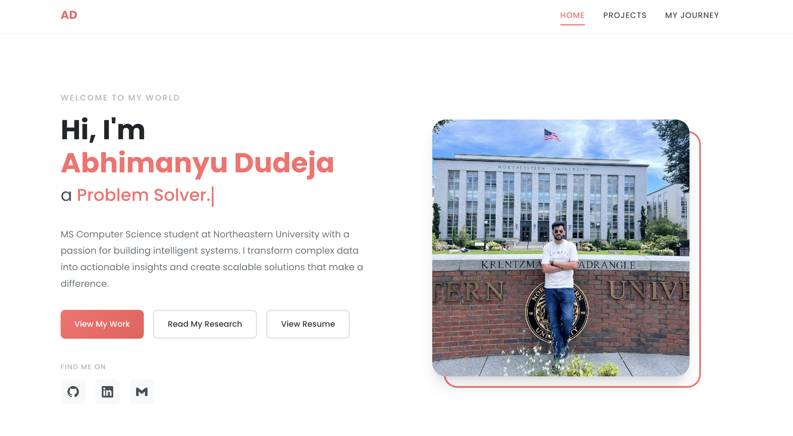

# Abhimanyu Dudeja - Personal Portfolio Website

A responsive personal portfolio website built with vanilla HTML5, CSS3, and ES6+ JavaScript modules.



## Author

**Abhimanyu Dudeja**  
MS Computer Science Student  
Northeastern University, Khoury College of Computer Sciences  
📧 dudeja.ab@northeastern.edu  
🔗 [LinkedIn](https://www.linkedin.com/in/abhimanyududeja/) | [GitHub](https://github.com/abhimanyududeja)

## Class Link

CS5610 - Web Development  
Northeastern University  
Spring 2025

## Project Objective

Create a personal homepage using vanilla HTML5, CSS3, and ES6+ JavaScript that:
- Showcases my professional profile, skills, and projects
- Demonstrates proficiency in modern web development practices
- Follows accessibility and W3C compliance standards
- Includes original JavaScript functionality and creative components
- Is deployed as a static website on GitHub Pages

## Live Demo

🌐 [View Live Site](https://abhimanyududeja.github.io)

## Features

### Pages
1. **Homepage (index.html)** - Hero section with typing animation, skills overview, and research highlight
2. **Projects (projects.html)** - Filterable project gallery with interactive cards
3. **My Journey (journey.html)** - AI-generated interactive timeline of my career path

### Original Components
- **Typing Animation**: Custom TypeWriter class (~100 lines) that creates a typewriter effect cycling through different roles. 100% original JavaScript, not from any library.
- **Project Filter**: Interactive category-based project filtering
- **Timeline Animator**: Scroll-triggered animations for timeline items

### Technical Features
- ES6 modules with `type="module"`
- CSS custom properties (variables)
- Flexbox and CSS Grid layouts
- Intersection Observer API for scroll animations
- Semantic HTML5 structure
- Responsive design for all screen sizes

## Project Structure

```
abhimanyu-portfolio/
├── index.html              # Homepage
├── projects.html           # Projects page
├── journey.html            # AI-generated journey page
├── css/
│   ├── main.css           # Shared styles and variables
│   ├── home.css           # Homepage-specific styles
│   ├── projects.css       # Projects page styles
│   └── journey.css        # Journey page styles
├── js/
│   ├── main.js            # Shared functionality
│   ├── typing.js          # Typing animation module
│   ├── projects.js        # Project filtering module
│   └── journey.js         # Timeline animation module
├── images/
│   ├── profile.png        # Profile photo
│   └── favicon.png        # Site favicon
├── docs/
│   ├── design-document.md  # Design documentation
│   └── Abhimanyu_Dudeja_Resume.pdf # Resume
├── package.json           # Project configuration
├── .eslintrc.json         # ESLint configuration
├── .prettierrc            # Prettier configuration
├── LICENSE                # MIT License
└── README.md              # This file
```

## Instructions to Build

### Prerequisites
- Node.js (v18 or higher)
- npm (comes with Node.js)

### Installation

1. Clone the repository:
```bash
git clone https://github.com/abhimanyududeja/abhimanyududeja.github.io.git
cd abhimanyududeja.github.io
```

2. Install dependencies:
```bash
npm install
```

3. Run the local development server:
```bash
npm start
```

4. Open your browser and navigate to `http://localhost:3000`

### Available Scripts

| Command | Description |
|---------|-------------|
| `npm start` | Start local development server |
| `npm run lint` | Run ESLint on JavaScript files |
| `npm run lint:fix` | Fix ESLint errors automatically |
| `npm run format` | Format all files with Prettier |
| `npm run format:check` | Check formatting without changing files |
| `npm run validate` | Validate HTML files |

### Deployment to GitHub Pages

1. Create a repository named `username.github.io` on GitHub
2. Push your code:
```bash
git add .
git commit -m "Initial portfolio commit"
git push origin main
```
3. Enable GitHub Pages in repository settings
4. Your site will be live at `https://username.github.io`

## Technologies Used

- **HTML5** - Semantic markup
- **CSS3** - Custom properties, Flexbox, Grid, animations
- **JavaScript ES6+** - Modules, classes, arrow functions, template literals
- **Google Fonts** - Poppins, Playfair Display
- **ESLint** - JavaScript linting
- **Prettier** - Code formatting

## Browser Support

- Chrome (latest)
- Firefox (latest)
- Safari (latest)
- Edge (latest)

## Accessibility

- Semantic HTML elements
- Alt text for all images
- ARIA labels for interactive elements
- Keyboard navigation support
- Sufficient color contrast ratios

## GenAI Usage Disclosure

This project was developed with assistance from Claude AI (Anthropic).

### AI-Generated Content:
- **Journey Page (journey.html)**: The timeline content, narrative descriptions, and structure were generated with AI assistance based on personal information provided.

### How AI was used:
1. **Code Generation**: Claude helped generate the initial HTML structure, CSS styles, and JavaScript modules based on project requirements.
2. **Documentation**: This README and the design document were created with AI assistance.
3. **Code Review**: Claude provided suggestions for improving code quality and accessibility.

### Human Contributions:
- Project concept and design direction
- Personal content and information
- Profile photography
- Final review and customization
- Deployment and testing

## License

This project is licensed under the MIT License - see the [LICENSE](LICENSE) file for details.

---

© 2025 Abhimanyu Dudeja. All rights reserved.
